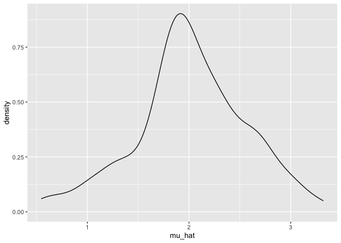
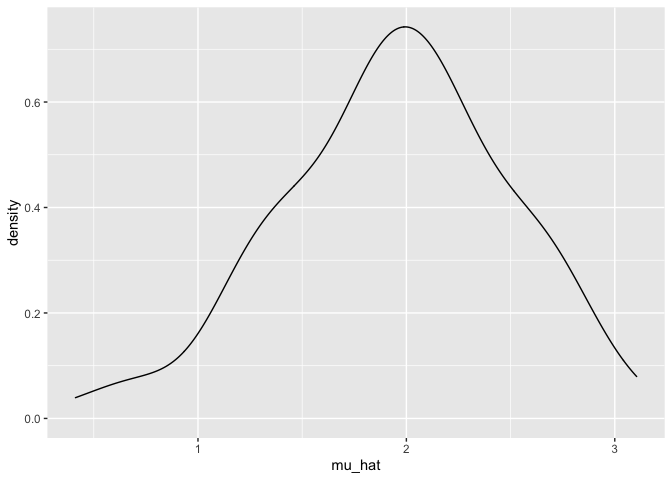
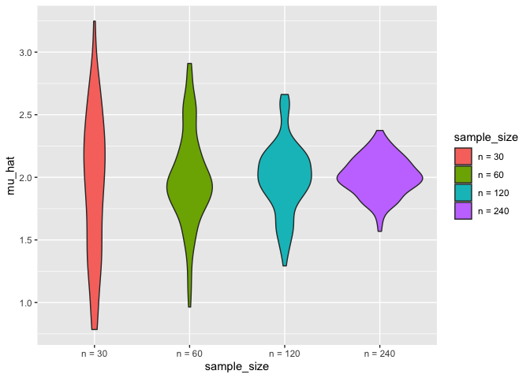

Iteration
================
Zoey Zhao
11/18/2021

``` r
library(tidyverse)
library(rvest)
set.seed(1)
```

# Writing Functions

``` r
x_vec = rnorm(25, mean = 5, sd = 3)

(x_vec - mean(x_vec)) / sd(x_vec)
```

    ##  [1] -0.83687228  0.01576465 -1.05703126  1.50152998  0.16928872 -1.04107494
    ##  [7]  0.33550276  0.59957343  0.42849461 -0.49894708  1.41364561  0.23279252
    ## [13] -0.83138529 -2.50852027  1.00648110 -0.22481531 -0.19456260  0.81587675
    ## [19]  0.68682298  0.44756609  0.78971253  0.64568566 -0.09904161 -2.27133861
    ## [25]  0.47485186

``` r
z_scores = function(x) {
  
  z = (x - mean(x)) / sd(x)
  z
  
}

z_scores(x_vec)
```

    ##  [1] -0.83687228  0.01576465 -1.05703126  1.50152998  0.16928872 -1.04107494
    ##  [7]  0.33550276  0.59957343  0.42849461 -0.49894708  1.41364561  0.23279252
    ## [13] -0.83138529 -2.50852027  1.00648110 -0.22481531 -0.19456260  0.81587675
    ## [19]  0.68682298  0.44756609  0.78971253  0.64568566 -0.09904161 -2.27133861
    ## [25]  0.47485186

``` r
mean_and_sd = function(x) {
  
  if (!is.numeric(x)) {
    stop("Argument x should be numeric")
  } else if (length(x) == 1) {
    stop("Cannot be computed for length 1 vectors")
  }
  
  mean_x = mean(x)
  sd_x = sd(x)

  list(mean = mean_x, 
       sd = sd_x)
}
```

# List

``` r
l = list(
  vec_numeric = 5:8,
  mat         = matrix(1:8, 2, 4),
  vec_logical = c(TRUE, FALSE),
  summary     = summary(rnorm(1000)))
l
```

    ## $vec_numeric
    ## [1] 5 6 7 8
    ## 
    ## $mat
    ##      [,1] [,2] [,3] [,4]
    ## [1,]    1    3    5    7
    ## [2,]    2    4    6    8
    ## 
    ## $vec_logical
    ## [1]  TRUE FALSE
    ## 
    ## $summary
    ##     Min.  1st Qu.   Median     Mean  3rd Qu.     Max. 
    ## -3.00805 -0.70396 -0.04090 -0.01957  0.68843  3.81028

``` r
l$vec_numeric
```

    ## [1] 5 6 7 8

``` r
l[[1]][1:3]
```

    ## [1] 5 6 7

# for loops

``` r
list_norms = 
  list(
    a = rnorm(20, 3, 1),
    b = rnorm(20, 0, 5),
    c = rnorm(20, 10, .2),
    d = rnorm(20, -3, 1)
  )

is.list(list_norms)
```

    ## [1] TRUE

``` r
mean_and_sd = function(x) {
  
  if (!is.numeric(x)) {
    stop("Argument x should be numeric")
  } else if (length(x) == 1) {
    stop("Cannot be computed for length 1 vectors")
  }
  
  mean_x = mean(x)
  sd_x = sd(x)

  tibble(
    mean = mean_x, 
    sd = sd_x
  )
}
```

``` r
output = vector("list", length = 4) #a list of four NULLs

for (i in 1:4) {
  output[[i]] = mean_and_sd(list_norms[[i]])
}

output
```

    ## [[1]]
    ## # A tibble: 1 × 2
    ##    mean    sd
    ##   <dbl> <dbl>
    ## 1  3.01 0.934
    ## 
    ## [[2]]
    ## # A tibble: 1 × 2
    ##    mean    sd
    ##   <dbl> <dbl>
    ## 1  1.13  5.64
    ## 
    ## [[3]]
    ## # A tibble: 1 × 2
    ##    mean    sd
    ##   <dbl> <dbl>
    ## 1  9.95 0.198
    ## 
    ## [[4]]
    ## # A tibble: 1 × 2
    ##    mean    sd
    ##   <dbl> <dbl>
    ## 1 -2.80 0.985

# map

``` r
output = map(list_norms, mean_and_sd)
output
```

    ## $a
    ## # A tibble: 1 × 2
    ##    mean    sd
    ##   <dbl> <dbl>
    ## 1  3.01 0.934
    ## 
    ## $b
    ## # A tibble: 1 × 2
    ##    mean    sd
    ##   <dbl> <dbl>
    ## 1  1.13  5.64
    ## 
    ## $c
    ## # A tibble: 1 × 2
    ##    mean    sd
    ##   <dbl> <dbl>
    ## 1  9.95 0.198
    ## 
    ## $d
    ## # A tibble: 1 × 2
    ##    mean    sd
    ##   <dbl> <dbl>
    ## 1 -2.80 0.985

``` r
output = map(.x = list_norms, ~ mean_and_sd(.x)) #produce the same result
```

## map variant

``` r
output = map_dbl(list_norms, median, .id = "input")
output
```

    ##          a          b          c          d 
    ##  2.8817450  0.9381959  9.9816278 -2.8258886

``` r
output = map_dfr(list_norms, mean_and_sd, .id = "input")
output
```

    ## # A tibble: 4 × 3
    ##   input  mean    sd
    ##   <chr> <dbl> <dbl>
    ## 1 a      3.01 0.934
    ## 2 b      1.13 5.64 
    ## 3 c      9.95 0.198
    ## 4 d     -2.80 0.985

When your function has two arguments:

``` r
#output = map2(.x = input_1, .y = input_2, ~func(arg_1 = .x, arg_2 = .y))
```

# List columns and operations

``` r
listcol_df = 
  tibble(
    name = c("a", "b", "c", "d"),
    samp = list_norms
  )

listcol_df
```

    ## # A tibble: 4 × 2
    ##   name  samp        
    ##   <chr> <named list>
    ## 1 a     <dbl [20]>  
    ## 2 b     <dbl [20]>  
    ## 3 c     <dbl [20]>  
    ## 4 d     <dbl [20]>

``` r
listcol_df$samp
```

    ## $a
    ##  [1] 1.747644 1.990496 3.751391 1.691646 3.527540 2.466460 2.601624 2.210431
    ##  [9] 2.769859 3.877185 3.453733 2.767536 3.870006 4.656004 2.993631 3.470489
    ## [17] 3.278219 2.022097 2.073414 4.919770
    ## 
    ## $b
    ##  [1]   4.4063889   3.7104089   0.7378670   2.4269428   0.7592802   0.2099938
    ##  [7]   1.1171116  -5.0523254  12.0061105   4.0098090  -1.2560398   6.0644469
    ## [13]  -3.1362904   8.5557925  -1.9718678 -11.6074543   6.8205960   5.6611457
    ## [19]  -3.8715816  -7.0518748
    ## 
    ## $c
    ##  [1]  9.633094  9.946197  9.633214  9.837106 10.032714 10.171104  9.836007
    ##  [8]  9.975279 10.050990 10.343785  9.808291  9.679138  9.630878 10.111147
    ## [15]  9.987976 10.154417  9.971832 10.078619 10.044844 10.004708
    ## 
    ## $d
    ##  [1] -3.622963 -1.737991 -3.405774 -2.333236 -2.835361 -1.218476 -2.288786
    ##  [8] -3.337691 -3.009149 -3.125309 -5.090846 -1.302606 -1.936119 -3.766617
    ## [15] -2.617992 -2.758104 -4.132759 -1.510093 -3.248247 -2.816416

``` r
map(listcol_df$samp, mean_and_sd)
```

    ## $a
    ## # A tibble: 1 × 2
    ##    mean    sd
    ##   <dbl> <dbl>
    ## 1  3.01 0.934
    ## 
    ## $b
    ## # A tibble: 1 × 2
    ##    mean    sd
    ##   <dbl> <dbl>
    ## 1  1.13  5.64
    ## 
    ## $c
    ## # A tibble: 1 × 2
    ##    mean    sd
    ##   <dbl> <dbl>
    ## 1  9.95 0.198
    ## 
    ## $d
    ## # A tibble: 1 × 2
    ##    mean    sd
    ##   <dbl> <dbl>
    ## 1 -2.80 0.985

The map function returns a list; we could store the results as a new
list column.

``` r
listcol_df = 
  listcol_df %>% 
  mutate(summary = map(samp, mean_and_sd))

listcol_df
```

    ## # A tibble: 4 × 3
    ##   name  samp         summary         
    ##   <chr> <named list> <named list>    
    ## 1 a     <dbl [20]>   <tibble [1 × 2]>
    ## 2 b     <dbl [20]>   <tibble [1 × 2]>
    ## 3 c     <dbl [20]>   <tibble [1 × 2]>
    ## 4 d     <dbl [20]>   <tibble [1 × 2]>

``` r
listcol_df$summary
```

    ## $a
    ## # A tibble: 1 × 2
    ##    mean    sd
    ##   <dbl> <dbl>
    ## 1  3.01 0.934
    ## 
    ## $b
    ## # A tibble: 1 × 2
    ##    mean    sd
    ##   <dbl> <dbl>
    ## 1  1.13  5.64
    ## 
    ## $c
    ## # A tibble: 1 × 2
    ##    mean    sd
    ##   <dbl> <dbl>
    ## 1  9.95 0.198
    ## 
    ## $d
    ## # A tibble: 1 × 2
    ##    mean    sd
    ##   <dbl> <dbl>
    ## 1 -2.80 0.985

# Nested data

``` r
weather_df = 
  rnoaa::meteo_pull_monitors(
    c("USW00094728", "USC00519397", "USS0023B17S"),
    var = c("PRCP", "TMIN", "TMAX"), 
    date_min = "2017-01-01",
    date_max = "2017-12-31") %>%
  mutate(
    name = recode(
      id, 
      USW00094728 = "CentralPark_NY", 
      USC00519397 = "Waikiki_HA",
      USS0023B17S = "Waterhole_WA"),
    tmin = tmin / 10,
    tmax = tmax / 10) %>%
  select(name, id, everything())
```

The station name and id are constant across the year’s temperature and
precipitation data. For that reason, we can reorganize these data into a
new data frame with a single row for each station.

``` r
weather_nest = 
  nest(weather_df, data = date:tmin)

weather_nest
```

    ## # A tibble: 3 × 3
    ##   name           id          data              
    ##   <chr>          <chr>       <list>            
    ## 1 CentralPark_NY USW00094728 <tibble [365 × 4]>
    ## 2 Waikiki_HA     USC00519397 <tibble [365 × 4]>
    ## 3 Waterhole_WA   USS0023B17S <tibble [365 × 4]>

``` r
weather_nest %>% pull(data)
```

    ## [[1]]
    ## # A tibble: 365 × 4
    ##    date        prcp  tmax  tmin
    ##    <date>     <dbl> <dbl> <dbl>
    ##  1 2017-01-01     0   8.9   4.4
    ##  2 2017-01-02    53   5     2.8
    ##  3 2017-01-03   147   6.1   3.9
    ##  4 2017-01-04     0  11.1   1.1
    ##  5 2017-01-05     0   1.1  -2.7
    ##  6 2017-01-06    13   0.6  -3.8
    ##  7 2017-01-07    81  -3.2  -6.6
    ##  8 2017-01-08     0  -3.8  -8.8
    ##  9 2017-01-09     0  -4.9  -9.9
    ## 10 2017-01-10     0   7.8  -6  
    ## # … with 355 more rows
    ## 
    ## [[2]]
    ## # A tibble: 365 × 4
    ##    date        prcp  tmax  tmin
    ##    <date>     <dbl> <dbl> <dbl>
    ##  1 2017-01-01     0  26.7  16.7
    ##  2 2017-01-02     0  27.2  16.7
    ##  3 2017-01-03     0  27.8  17.2
    ##  4 2017-01-04     0  27.2  16.7
    ##  5 2017-01-05     0  27.8  16.7
    ##  6 2017-01-06     0  27.2  16.7
    ##  7 2017-01-07     0  27.2  16.7
    ##  8 2017-01-08     0  25.6  15  
    ##  9 2017-01-09     0  27.2  15.6
    ## 10 2017-01-10     0  28.3  17.2
    ## # … with 355 more rows
    ## 
    ## [[3]]
    ## # A tibble: 365 × 4
    ##    date        prcp  tmax  tmin
    ##    <date>     <dbl> <dbl> <dbl>
    ##  1 2017-01-01   432  -6.8 -10.7
    ##  2 2017-01-02    25 -10.5 -12.4
    ##  3 2017-01-03     0  -8.9 -15.9
    ##  4 2017-01-04     0  -9.9 -15.5
    ##  5 2017-01-05     0  -5.9 -14.2
    ##  6 2017-01-06     0  -4.4 -11.3
    ##  7 2017-01-07    51   0.6 -11.5
    ##  8 2017-01-08    76   2.3  -1.2
    ##  9 2017-01-09    51  -1.2  -7  
    ## 10 2017-01-10     0  -5   -14.2
    ## # … with 355 more rows

Suppose we want to fit the simple linear regression relating tmax to
tmin for each station-specific data frame. First I’ll write a quick
function that takes a data frame as the sole argument to fit this model.

``` r
weather_lm = function(df) {
  lm(tmax ~ tmin, data = df)
}

weather_lm(weather_nest$data[[1]])
```

    ## 
    ## Call:
    ## lm(formula = tmax ~ tmin, data = df)
    ## 
    ## Coefficients:
    ## (Intercept)         tmin  
    ##       7.209        1.039

Since weather$data is a list, we can apply our weather\_lm function to
each data frame using map.

``` r
map(weather_nest$data, weather_lm)
```

    ## [[1]]
    ## 
    ## Call:
    ## lm(formula = tmax ~ tmin, data = df)
    ## 
    ## Coefficients:
    ## (Intercept)         tmin  
    ##       7.209        1.039  
    ## 
    ## 
    ## [[2]]
    ## 
    ## Call:
    ## lm(formula = tmax ~ tmin, data = df)
    ## 
    ## Coefficients:
    ## (Intercept)         tmin  
    ##     20.0966       0.4509  
    ## 
    ## 
    ## [[3]]
    ## 
    ## Call:
    ## lm(formula = tmax ~ tmin, data = df)
    ## 
    ## Coefficients:
    ## (Intercept)         tmin  
    ##       7.499        1.221

Alternatively,

``` r
map(weather_nest$data, ~lm(tmax ~ tmin, data = .x))
```

    ## [[1]]
    ## 
    ## Call:
    ## lm(formula = tmax ~ tmin, data = .x)
    ## 
    ## Coefficients:
    ## (Intercept)         tmin  
    ##       7.209        1.039  
    ## 
    ## 
    ## [[2]]
    ## 
    ## Call:
    ## lm(formula = tmax ~ tmin, data = .x)
    ## 
    ## Coefficients:
    ## (Intercept)         tmin  
    ##     20.0966       0.4509  
    ## 
    ## 
    ## [[3]]
    ## 
    ## Call:
    ## lm(formula = tmax ~ tmin, data = .x)
    ## 
    ## Coefficients:
    ## (Intercept)         tmin  
    ##       7.499        1.221

Let’s use mutate to fit this model, and to store the result in the same
dataframe.

``` r
weather_nest = 
  weather_nest %>% 
  mutate(models = map(data, weather_lm))

weather_nest
```

    ## # A tibble: 3 × 4
    ##   name           id          data               models
    ##   <chr>          <chr>       <list>             <list>
    ## 1 CentralPark_NY USW00094728 <tibble [365 × 4]> <lm>  
    ## 2 Waikiki_HA     USC00519397 <tibble [365 × 4]> <lm>  
    ## 3 Waterhole_WA   USS0023B17S <tibble [365 × 4]> <lm>

# Revisiting Napoleon

``` r
library(rvest)
```

``` r
read_page_reviews = function(url) {
  
  html = read_html(url)
  
  title = 
    html %>%
    html_nodes("#cm_cr-review_list .review-title") %>%
    html_text()
  
  stars = 
    html %>%
    html_nodes("#cm_cr-review_list .review-rating") %>%
    html_text() %>%
    str_extract("\\d") %>%
    as.numeric()
  
  text = 
    html %>%
    html_nodes(".review-data:nth-child(5)") %>%
    html_text()
  
  tibble(title, stars, text)
}
```

We can use this function to read the five pages of reviews on the URLs
defined in the code chunk below.

``` r
url_base = "https://www.amazon.com/product-reviews/B00005JNBQ/ref=cm_cr_arp_d_viewopt_rvwer?ie=UTF8&reviewerType=avp_only_reviews&sortBy=recent&pageNumber="
vec_urls = str_c(url_base, 1:5)
```

``` r
dynamite_reviews = map_df(vec_urls, read_page_reviews)
```

# Simulation: Mean and SD for one n

``` r
sim_mean_sd = function(n, mu = 2, sigma = 3) {
  
  sim_data = tibble(
    x = rnorm(n, mean = mu, sd = sigma),
  )
  
  sim_data %>% 
    summarize(
      mu_hat = mean(x),
      sigma_hat = sd(x)
    )
}
```

``` r
output = vector("list", 100)

for (i in 1:100) {
  output[[i]] = sim_mean_sd(30)
}

sim_results = bind_rows(output)
sim_results %>% 
  ggplot(aes(x = mu_hat)) + 
  geom_density()
```

<!-- -->

``` r
sim_results = 
  rerun(100, sim_mean_sd(30, 2, 3)) %>% 
  bind_rows()
sim_results %>% 
  ggplot(aes(x = mu_hat)) + 
  geom_density()
```

<!-- -->

``` r
sim_results %>% 
  pivot_longer(
    mu_hat:sigma_hat,
    names_to = "parameter", 
    values_to = "estimate") %>% 
  group_by(parameter) %>% 
  summarize(
    emp_mean = mean(estimate),
    emp_sd = sd(estimate)) %>% 
  knitr::kable(digits = 3)
```

| parameter  | emp\_mean | emp\_sd |
|:-----------|----------:|--------:|
| mu\_hat    |     1.942 |   0.542 |
| sigma\_hat |     2.996 |   0.339 |

# Simulation: Mean for several n’s

``` r
n_list = 
  list(
    "n_30"  = 30, 
    "n_60"  = 60, 
    "n_120" = 120, 
    "n_240" = 240)

output = vector("list", length = 4)

for (i in 1:4) {
  output[[i]] = rerun(100, sim_mean_sd(n_list[[i]])) %>% 
    bind_rows
}
```

After this loop, `output` is a list of 4 data frames; each data frame
contains the results of 100 simulations at different sample sizes.

Let’s recast this using list columns and map

``` r
sim_results = 
  tibble(sample_size = c(30, 60, 120, 240)) %>% 
  mutate(
    output_lists = map(.x = sample_size, ~rerun(100, sim_mean_sd(n = .x))),
    estimate_dfs = map(output_lists, bind_rows)) %>% 
  select(-output_lists) %>% 
  unnest(estimate_dfs)
```

``` r
sim_results %>% 
  mutate(
    sample_size = str_c("n = ", sample_size),
    sample_size = fct_inorder(sample_size)) %>% 
  ggplot(aes(x = sample_size, y = mu_hat, fill = sample_size)) + 
  geom_violin()
```

<!-- -->

Lastly I’ll look at the empirical mean and variance of these estimates.

``` r
sim_results %>% 
  pivot_longer(
    mu_hat:sigma_hat,
    names_to = "parameter", 
    values_to = "estimate") %>% 
  group_by(parameter, sample_size) %>% 
  summarize(
    emp_mean = mean(estimate),
    emp_var = var(estimate)) %>% 
  knitr::kable(digits = 3)
```

    ## `summarise()` has grouped output by 'parameter'. You can override using the `.groups` argument.

| parameter  | sample\_size | emp\_mean | emp\_var |
|:-----------|-------------:|----------:|---------:|
| mu\_hat    |           30 |     1.934 |    0.333 |
| mu\_hat    |           60 |     1.991 |    0.141 |
| mu\_hat    |          120 |     1.995 |    0.078 |
| mu\_hat    |          240 |     2.008 |    0.024 |
| sigma\_hat |           30 |     3.014 |    0.173 |
| sigma\_hat |           60 |     2.953 |    0.060 |
| sigma\_hat |          120 |     2.969 |    0.031 |
| sigma\_hat |          240 |     3.017 |    0.016 |
